# 《宮闈浮生》後端規格書

> 版本：v0.8  
> 修訂：2026-08-15，加入玩家人物圖片，以及管理後台故事、稱號與設定模型  
> 狀態：可進入資料庫 Migration、API Contract 與後端 Sprint 規劃  
> 技術：ASP.NET Core Web API + PostgreSQL 17/18 + EF Core/Npgsql  
> 玩家前台：GitHub Pages 靜態 Web  
> 管理後台：ASP.NET Core MVC／Razor Pages，部署於 IIS  
> 玩法依據：[遊戲企劃規格書_v0.6.md](./遊戲企劃規格書_v0.6.md)  
> 前端依據：[前端規格書_v0.7.md](./前端規格書_v0.7.md)

---

## 0. 本版交付物

v0.8 不再只列「可能有哪些資料表／API」，而是拆成三份可以開工的文件：

| 文件 | 用途 | 規模 |
|---|---|---|
| 本文件 | 架構、領域規則、交易、狀態、開發順序 | 後端實作基準 |
| [schema_v0.8.sql](./backend-spec/schema_v0.8.sql) | 可執行 PostgreSQL DDL | 60 張 Table、FK、Check、Partial Unique Index、Trigger |
| [api_v1_v0.8.md](./backend-spec/api_v1_v0.8.md) | 完整 HTTP Contract 清單 | 232 個 Method + Path、權限、DTO、錯誤與交易要求 |

`schema_v0.8.sql` 是資料庫結構的權威來源；EF Core Migration 產物必須與其語意一致。API 開發時需同步產生 OpenAPI，CI 比對 Breaking Change。

---

## 1. 系統範圍

### 1.1 服務對象

- 約 200 名一般玩家、10 名管理員。
- 不以 200 人作為遊戲規則硬上限。
- 容量驗證基準：50 位同時活躍使用者，加上事件開啟／截止瞬間尖峰。
- 一個 LINE 帳號只能有一名目前角色；死亡或封存角色保留歷史後可以重新填單。
- 玩家可扮演嬪妃、皇子、公主；人物可使用官方預設立繪或經審核的玩家上傳圖片。
- LINE 群只作自由互動與人工公告，不讀取群訊息自動判分。

### 1.2 後端責任

- LINE Login、Session、CSRF 與管理員 RBAC。
- 建角申請、角色生命週期、一帳號一角。
- 位階、居所、能力、資源、關係與生涯紀錄。
- 非同步事件房、外部互動投稿、結算。
- 宮市、庫存、道具、不可變帳本。
- 侍奉、懷孕、待生池、流產、出生抽取。
- 陰謀、狀態效果、調查與永久死亡。
- 通知、公告、排程、稽核、雙人覆核、備份。
- 玩家人物圖片的驗證、轉檔、儲存、裁切資料與管理員審核。
- 管理網頁的故事／章節／分支編輯、人物稱號授予及具版本的遊戲設定發布。

### 1.3 非目標

- 不做即時聊天室、WebSocket 同步戰鬥。
- 不讀取 LINE 群對話。
- 不提供一般聊天附件上傳；人物圖片僅能經專用端點、固定格式與審核流程上傳。
- MVP 不拆微服務，不需要 Redis、Kafka、Kubernetes。
- 不允許 AI 自動裁定永久死亡、停權或真人爭議。

---

## 2. 部署與 Solution 結構

### 2.1 拓撲

```text
玩家 ── HTTPS ── game.<domain> ── GitHub Pages 玩家前台
                          │ Cookie + CSRF API Request
                          ▼
管理員 ─ HTTPS ─ admin.<domain> ─┐
                                 ├─ IIS
玩家前台 ─────── api.<domain> ───┤  ├─ GongWei.Api (ASP.NET Core)
                                 │  └─ GongWei.Admin (MVC / Razor Pages)
                                 └──────── private network
                                              ├─ PostgreSQL 17/18
                                              └─ persistent media volume / S3-compatible storage

Windows Service: GongWei.Worker ── Scheduler / Outbox / Cleanup
```

正式管理後台只由 `admin.<domain>` 的 IIS Site 提供，不部署於 GitHub Pages。PostgreSQL 與原始媒體目錄不得對公網開放。IIS 負責 HTTPS Binding 並透過 ASP.NET Core Module 啟動 Kestrel；應用程式只接受已知 Proxy／IIS Integration 傳入的 Forwarded Headers。玩家圖片不可寫入 GitHub Pages、IIS Web Root 或資料庫 bytea；資料庫只保存 Storage Key、Hash、尺寸、裁切與審核狀態。

### 2.2 Solution

```text
GongWeiFuSheng.sln
├─ src/
│  ├─ GongWei.Api/              Controllers/Endpoints, Middleware, OpenAPI
│  ├─ GongWei.Admin/            ASP.NET Core MVC/Razor Pages, Admin UI, AntiForgery
│  ├─ GongWei.Application/      Commands, Queries, DTO, Validators, Policies
│  ├─ GongWei.Domain/           Aggregate, State Machine, Domain Error/Event
│  ├─ GongWei.Infrastructure/   EF Core, Npgsql, LINE, Outbox, Clock, RNG
│  └─ GongWei.Worker/           Scheduler, Outbox Dispatcher, Cleanup
├─ tests/
│  ├─ GongWei.Domain.Tests/
│  ├─ GongWei.Api.Tests/
│  ├─ GongWei.Postgres.Tests/
│  └─ GongWei.LoadTests/
└─ deploy/
   ├─ iis/
   │  ├─ api.web.config
   │  ├─ admin.web.config
   │  └─ install-sites.ps1
   ├─ worker/
   │  └─ install-service.ps1
   └─ backup/
```

API Controller 與 Admin Controller／PageModel 只處理 HTTP、Model Binding 與畫面流程；兩者共同呼叫 Application Use Case，不允許 Admin Web 以 Loopback HTTP 呼叫自己的 API，也不得直接繞過 Domain 修改 EF Entity。遊戲規則放 Application／Domain；Infrastructure 不可把 EF Entity 直接回傳給前端。

### 2.3 IIS 部署規範

- 安裝與目標 .NET 版本相符的 ASP.NET Core Hosting Bundle；API 與 Admin 使用不同 IIS Site、Application Pool 及低權限 Service Identity。
- Application Pool 設為 `No Managed Code`、`AlwaysRunning`，Site 啟用 Preload；排程不可依賴 IIS 常駐，`GongWei.Worker` 必須另裝為 Windows Service。
- `api.<domain>` 與 `admin.<domain>` 各自設定 HTTPS Binding、有效憑證、HTTP→HTTPS、HSTS 與 Host Allowlist；Production 不開 IIS Directory Browsing。
- `GongWei.Admin` 使用獨立的 `gw_admin_session` HttpOnly Cookie、ASP.NET Core AntiForgery 與後端 Policy Authorization；登入後仍以資料庫 Admin Role 判權。
- Data Protection Key Ring 存於部署目錄之外的持久化路徑，授權給兩個指定 App Pool Identity，並以 DPAPI 或憑證保護；部署不可清除 Key Ring。
- 玩家媒體存於 Web Root 外，IIS Identity 只取得所需讀寫權。IIS `requestFiltering`、ASP.NET Core RequestSizeLimit 與應用驗證三層限制 Upload Size。
- Connection String、LINE Secret、Cookie／Data Protection 設定及媒體路徑不提交 Git；以 IIS／Windows 安全設定或受保護的環境設定注入。
- 發布採獨立 Release 目錄；切換前執行 Migration 與 `/health/ready`，失敗時保留上一版可回復。Production 不開啟詳細錯誤與長期 stdout Log。

---

## 3. 模組與依賴方向

| 模組 | 核心資料 | 可依賴 | 不可反向依賴 |
|---|---|---|---|
| Identity | Users、Sessions、Admin Roles | Audit | Economy／Events 不得決定登入 |
| Characters | Application、Character、Portrait、Media、Title、Stats、Rank、Residence | Identity、Audit | 前端不能改角色狀態 |
| World/Content | World State、Locations、Story、Chapter、Node、Game Setting | Characters、Approval、Audit | 已發布內容不得無版本覆寫 |
| Events | Rooms、Participants、Posts、Results | Characters、Economy、Relationships、Outbox | Economy 不依賴 Event UI |
| Economy | Wallet、Ledger、Item、Inventory、Market | Characters、Audit | 不接受前端價格 |
| Relationships | Relationship、History | Characters、Events | — |
| Reproduction | Control、Wait Pool、Audience、Pregnancy、Birth | Characters、Outbox、Audit | 不依賴前端顯示名額 |
| Intrigue | Actions、Effects、Death | Characters、Economy、Approval | 不直接跳過 Approval 死亡 |
| Operations | Notification、Announcement、Approval、Audit、Jobs、Outbox | 全模組 Domain Event | 不包含玩法規則 |

模組間在同一 PostgreSQL 交易內協作，但透過 Application Use Case 與 Domain Event，不允許 Controller 任意跨表拼 SQL。

---

## 4. 資料庫規範

### 4.1 共通欄位

- PK：`uuid`。API 優先產生 UUIDv7；資料庫以 `gen_random_uuid()` 作 Default。
- 時間：`timestamptz`，一律 UTC。
- 可變 Aggregate：`updated_at`、`version bigint`；更新時 `version + 1`。
- 動態規則 Snapshot：`jsonb`，必須有 JSON Schema／C# Validator，不把任意 JSON 當可信資料。
- 對玩家顯示的編號可另加 `code`，不得把流水號當授權依據。
- 刪除：重要遊戲資料 Soft State；不 Hard Delete Character、Ledger、Result、Death、Audit。

### 4.2 60 張資料表

#### Identity 與人物（17）

| Table | 主鍵／重要 FK | 最重要約束 |
|---|---|---|
| `users` | `id` | `line_user_id UNIQUE` |
| `user_sessions` | `user_id → users` | Token Hash Unique、到期順序 Check |
| `admin_role_assignments` | `(user_id, role)` | 固定 Role Check |
| `preset_portraits` | `id` | `code UNIQUE`、Role 固定 |
| `media_assets` | `owner_user_id` | Storage Key Unique、8 MB、尺寸、SHA-256、處理狀態 |
| `player_portrait_submissions` | `user_id, media_asset_id` | 每個媒體一筆送審、裁切 0–1、審核狀態 |
| `character_applications` | `user_id, portrait_id / player_portrait_submission_id` | 官方與上傳圖 XOR；每帳號僅一個 Open Application |
| `character_application_revisions` | `application_id` | `(application_id, revision_no) UNIQUE` |
| `ranks` | `id` | `(role, ordinal) UNIQUE` |
| `character_title_definitions` | `id` | Code Unique、Role／Visibility／Category Check |
| `residences` | `id` | Map 座標與 Capacity Check |
| `characters` | `user_id, source_application_id` | 官方與 Approved 上傳圖 XOR；每帳號僅一名目前角色 |
| `character_title_assignments` | `character_id, title_definition_id` | 每角色一個 Primary；撤回留歷史；Trigger 驗證 Role |
| `character_stats` | `character_id` | 四能力 0–100、資源範圍 Check |
| `character_status_history` | `character_id` | Append History |
| `rank_history` | `character_id, to_rank_id` | 不覆寫舊晉降紀錄 |
| `character_residence_history` | `character_id, residence_id` | 每角色一筆未搬出 Partial Unique |

#### 世界、故事與事件（14）

| Table | 用途 | 最重要約束 |
|---|---|---|
| `world_state` | 章節、宮廷日、全域開關 | Singleton ID = 1 |
| `game_settings` | 可由管理網頁調整的 Allowlist 設定 | Published／Draft 分離、JSON Schema、Risk Level |
| `game_setting_revisions` | 設定發布與回復歷程 | Append-only、Revision Unique、可連 Approval |
| `world_locations` | 2D 地圖地點 | Code Unique、座標 0–100 |
| `event_rooms` | 事件主檔 | Code Unique、截止晚於開啟 |
| `story_arcs` | 故事線主檔 | Code Unique、Draft／Published／Archived |
| `story_chapters` | 故事章節 | Arc 內 ChapterNo／Code Unique；發布需 Entry Node |
| `story_nodes` | 正文、選項、條件、事件與結局節點 | Chapter 內 Code Unique、唯一 Entry Node |
| `content_revisions` | 故事發布／編輯／回復快照 | Append-only、Resource Revision Unique |
| `event_participants` | 事件參與 | `(event, character)` PK |
| `event_posts` | 玩家投稿 | Body 長度、Client Request 防重複 |
| `event_post_revisions` | 投稿版本 | Revision Unique |
| `event_results` | 全體／個人結果 | Event + Nullable Character Unique |
| `external_play_submissions` | LINE 群等外部互動填單 | 審核狀態與 Queue Index |

#### 經濟、關係（11）

| Table | 用途 | 最重要約束 |
|---|---|---|
| `currencies` | 貨幣定義 | Code PK |
| `wallets` | 餘額 Snapshot | `(character, currency) UNIQUE`、不可負 |
| `ledger_transactions` | 一次經濟交易 Header | Reference、原因、操作者 |
| `ledger_entries` | 餘額異動 | Append-only Trigger、Amount 非 0 |
| `item_definitions` | 版本化道具 | `(code, version_no) UNIQUE` |
| `inventory_entries` | 目前庫存 | Character + Item + Expiry Unique |
| `inventory_transactions` | 庫存異動 | Append-only Trigger |
| `market_offers` | 商店刊登 | 價格、庫存、期間 Check |
| `purchases` | 購買憑證 | Character + Idempotency Unique |
| `relationships` | NPC／玩家關係 | Target Character/NPC 恰一個 |
| `relationship_history` | 關係異動 | `after = before + delta` |

#### 生育、陰謀（11）

| Table | 用途 | 最重要約束 |
|---|---|---|
| `reproduction_control` | 生育序列鎖與人工開關 | Singleton ID = 1 |
| `heir_wait_pool_entries` | 待生池 | 每角色一筆 Waiting Partial Unique；Trigger 限皇子女 |
| `audience_requests` | 侍膳／侍寢 | Character + Idempotency Unique |
| `pregnancies` | 懷孕與名額保留 | 每母方一筆 Ongoing；Slot 釋放狀態 Check |
| `births` | 正式出生抽取 | Pregnancy、Pool Entry、Child 全 Unique |
| `offspring_links` | 親子關係 | Parent Character/NPC 恰一個 |
| `intrigue_actions` | 下毒／調查 | Actor + Idempotency Unique |
| `status_effects` | 中毒／傷病等 | Active Effect Index |
| `deaths` | 永久死亡 | Character Unique |
| `notifications` | 站內通知 | User 未讀 Partial Index |
| `announcements` | 全域公告 | 時間區間 Check |

#### 營運（7）

| Table | 用途 | 最重要約束 |
|---|---|---|
| `approval_requests` | 高風險操作申請 | 固定 Action Handler、狀態與到期 |
| `approval_decisions` | 第二人決定 | Request + Reviewer Unique |
| `audit_logs` | 操作稽核 | Identity PK、Append-only Trigger |
| `idempotency_records` | HTTP 防重送 | User + Method + Path + Key Unique |
| `outbox_messages` | 交易後通知 | Pending Partial Index |
| `scheduled_jobs` | 排程定義與租約 | Job Key Unique |
| `job_runs` | 執行歷史 | Running/Finished Check |

### 4.3 關聯圖

```mermaid
erDiagram
    USERS ||--o{ USER_SESSIONS : owns
    USERS ||--o{ CHARACTER_APPLICATIONS : submits
    USERS ||--o{ CHARACTERS : plays
    CHARACTER_APPLICATIONS ||--o| CHARACTERS : creates
    PRESET_PORTRAITS ||--o{ CHARACTERS : renders
    CHARACTERS ||--|| CHARACTER_STATS : has
    CHARACTERS }o--o| RANKS : holds
    CHARACTERS }o--o| RESIDENCES : lives_in
    CHARACTER_TITLE_DEFINITIONS ||--o{ CHARACTER_TITLE_ASSIGNMENTS : defines
    CHARACTERS ||--o{ CHARACTER_TITLE_ASSIGNMENTS : receives

    EVENT_ROOMS ||--o{ EVENT_PARTICIPANTS : contains
    CHARACTERS ||--o{ EVENT_PARTICIPANTS : joins
    EVENT_ROOMS ||--o{ EVENT_POSTS : contains
    CHARACTERS ||--o{ EVENT_POSTS : authors
    EVENT_ROOMS ||--o{ EVENT_RESULTS : settles
    STORY_ARCS ||--o{ STORY_CHAPTERS : contains
    STORY_CHAPTERS ||--o{ STORY_NODES : contains
    EVENT_ROOMS ||--o{ STORY_NODES : links
    GAME_SETTINGS ||--o{ GAME_SETTING_REVISIONS : versions

    CHARACTERS ||--o{ WALLETS : owns
    WALLETS ||--o{ LEDGER_ENTRIES : records
    LEDGER_TRANSACTIONS ||--o{ LEDGER_ENTRIES : groups
    CHARACTERS ||--o{ INVENTORY_ENTRIES : owns
    ITEM_DEFINITIONS ||--o{ INVENTORY_ENTRIES : defines
    MARKET_OFFERS ||--o{ PURCHASES : receives

    CHARACTERS ||--o{ HEIR_WAIT_POOL_ENTRIES : waits
    CHARACTERS ||--o{ PREGNANCIES : carries
    PREGNANCIES ||--o| BIRTHS : resolves
    HEIR_WAIT_POOL_ENTRIES ||--o| BIRTHS : selected_by
    CHARACTERS ||--o{ OFFSPRING_LINKS : child_or_parent

    CHARACTERS ||--o{ INTRIGUE_ACTIONS : acts
    CHARACTERS ||--o{ STATUS_EFFECTS : affected
    CHARACTERS ||--o| DEATHS : may_have
    APPROVAL_REQUESTS ||--o{ APPROVAL_DECISIONS : requires
```



### 4.4 不可只靠資料庫 Check 的規則

以下規則需要 Application Service + Transaction；DDL Trigger 只作最後防線：

- Portrait Role 必須與角色 Role 一致。
- Rank `applies_to_role` 必須與 Character Role 一致。
- Residence Capacity 與身份資格。
- Event 加入資格、截止與參與上限。
- Wallet 更新與 Ledger Entry 必須同一交易。
- 待生容量的 `waiting - reserved` 計算。
- 出生等機率抽取與候選集合 Hash。
- Requester 不得覆核自己的 Approval。
- 死亡執行後取消未完成活動與目前角色資格。

---

## 5. 角色與帳號狀態

### 5.1 Application 狀態

| From | 可到 | 執行者 |
|---|---|---|
| `draft` | `submitted`, `cancelled` | 玩家 |
| `submitted` | `needs_revision`, `approved`, `rejected`, `cancelled` | 審核員；取消只限尚未 Claim |
| `needs_revision` | `submitted`, `cancelled` | 玩家 |
| `approved` | 終態 | 系統已建立角色 |
| `rejected` | 終態 | 可另外新建申請 |
| `cancelled` | 終態 | 可另外新建申請 |

### 5.2 Character 狀態

| From | 可到 | 說明 |
|---|---|---|
| 建立 | `waiting_birth` | 核准皇子／公主 |
| 建立 | `active` | 核准嬪妃 |
| `waiting_birth` | `active` | 被出生抽中 |
| `waiting_birth` | `suspended`, `archived` | 違規／撤回；需同步池狀態 |
| `active` | `paused`, `suspended`, `dead` | 請假、處置、永久死亡 |
| `paused` | `active`, `suspended`, `dead` | 請假沒有保護期 |
| `suspended` | 原合法狀態、`dead`, `archived` | 復歸需保存前狀態或顯式指定 |
| `dead` | `archived` | 死亡不可恢復 Active |
| `archived` | 終態 | 只供歷史查詢 |

資料庫 Partial Unique Index 只把 `waiting_birth/active/paused/suspended` 視為目前角色，因此 Dead/Archived 歷史不會阻止同一 LINE 帳號重建新角色。

---

## 6. 關鍵交易

### 6.1 核准角色申請

Transaction Isolation：`Read Committed` + Row Lock。

1. 以 `FOR UPDATE` 鎖 Application 與 User。
2. 檢查 Application = Submitted、Version、User 無目前角色。
3. 驗證 Portrait／Rank Role。
4. 建立 Character、CharacterStats、Wallet、StatusHistory。
5. 嬪妃建立為 Active；皇子／公主建立為 WaitingBirth 並新增 Wait Pool Waiting Entry。
6. Application → Approved，填 `created_character_id`。
7. 寫 Audit、Outbox。
8. Commit；任何一步失敗全部 Rollback。

### 6.2 侍寢成功與名額保留

```sql
BEGIN;
SELECT * FROM game.reproduction_control WHERE singleton_id = 1 FOR UPDATE;

SELECT count(*) FROM game.heir_wait_pool_entries WHERE status = 'waiting';
SELECT count(*) FROM game.pregnancies WHERE status = 'ongoing';
-- available = waiting - ongoing
-- available <= 0 => ROLLBACK + 409 HEIR_CAPACITY_EXHAUSTED

-- revalidate character/audience request under row locks
-- insert pregnancy with slot_reserved_at
-- resolve audience request, insert audit/outbox
COMMIT;
```

所有會新增、流產、完成懷孕或變更 Wait Pool Waiting 數量的流程，鎖定順序一律：

1. `reproduction_control(1)`。
2. `pregnancy`（若有）。
3. `wait_pool_entry`（若有）。
4. `character`。

### 6.3 流產

1. 鎖 ReproductionControl → Pregnancy。
2. 僅 Ongoing 可轉 Miscarried。
3. 同時設定 `slot_released_at`；Check 確保非 Ongoing 必須已釋放。
4. 寫 Status／Audit／Outbox。
5. 重送由 Idempotency 回傳原結果，不可再次釋放。

### 6.4 出生抽取

1. 鎖 ReproductionControl → Pregnancy。
2. 查出所有 `status = waiting` 候選 ID，固定以 UUID 排序並保存在記憶體。
3. 使用 `RandomNumberGenerator.GetInt32(candidateCount)` 等機率選 Index。
4. 鎖被選中的 Pool Entry 與 Character，再次確認仍 Waiting/WaitingBirth。
5. 寫 Birth，保存候選數、排序後 ID 串的 SHA-256、亂數證明 Hash、演算法與規則版本。
6. Selected Pool → Drawn；Child Character → Active；Pregnancy → Completed 並釋放 Slot。
7. 寫 OffspringLinks、StatusHistory、Audit、Outbox。
8. Commit。

因所有出生與候選異動先鎖同一 `reproduction_control`，抽取過程不會出現兩個 Pregnancy 抽到同一人物。Request 不接受指定 Child 或 Sex。

### 6.5 購買

1. 取得 Idempotency Record；相同 Key 不同 Body 回 409。
2. 鎖 MarketOffer → Wallet → InventoryEntry，固定順序。
3. 伺服器計算價格、期間、資格、限購與庫存。
4. 更新 Wallet Snapshot，新增 LedgerTransaction + LedgerEntry。
5. 更新／建立 InventoryEntry，新增 InventoryTransaction、Purchase。
6. 寫 Outbox，保存 Idempotency Response，Commit。

Ledger、Purchase、Inventory Transaction 皆保存當時 Snapshot；日後改價或改道具效果不回寫歷史。

### 6.6 事件結算

- 先呼叫 Preview，回傳會受影響角色與資源，但不寫 DB。
- Execute 需帶 `expectedEventVersion` 與 Idempotency Key。
- 鎖 EventRoom，再依 Character UUID 固定排序鎖 Stats、Wallet、Inventory、Relationship。
- EventResult、Reward、Ledger、Inventory、RelationshipHistory、通知同一交易。
- 成功後 Event → Settled；同一 Event 不得二次正式結算。

### 6.7 永久死亡

1. 第一位管理員呼叫 RequestDeath，建立 Pending Approval，不改 Character。
2. 第二位具權限且非 Requester 的管理員 Approve。
3. Execute 鎖 Approval → Character → 未完成 Event/Action/Effects。
4. Character → Dead，填 `died_at`；建立 Death 與 StatusHistory。
5. 取消不能繼續的 Action/Participant 資格、處理 Wait Pool／Pregnancy 例外。
6. 撤銷角色操作能力但保留 User Login 及歷史查詢。
7. Audit、Outbox、Approval → Executed，Commit。

### 6.8 玩家人物圖片上傳與審核

1. API 以 Multipart 接收單一檔案；先限制 Request Body 8 MB，再以 Magic Bytes 驗證 JPEG／PNG／WebP，不相信副檔名與 Content-Type。
2. 在隔離工作目錄解碼，限制像素總量與尺寸至少 600 × 800；移除 EXIF、ICC 中不需要的資料及動畫影格，重新編碼成 WebP。
3. 以 SHA-256 與不可猜測的 Storage Key 寫入持久化 Media Volume 或 S3-compatible Object Storage；PostgreSQL 只寫 `media_assets` Metadata。
4. Media → Ready 後建立 `player_portrait_submissions` Pending；玩家可在 Pending 階段更新 0–1 裁切座標或撤回。
5. 管理員核准時寫 Reviewer、時間、備註、Audit 與通知；拒絕已被申請引用的圖片時，同一交易將建角申請轉為 NeedsRevision。
6. 建立正式 Character 時，資料庫 Trigger 再檢查圖片為 Approved、Owner 與 User 相同、Role 相符；前端顯示不能取代此檢查。
7. Quarantined／Rejected／Withdrawn 且無引用的檔案由排程在保留期後刪除；禁止由 Web Root 直接列目錄，公開顯示使用受控媒體端點或短效簽章 URL。

### 6.9 管理內容與設定發布

1. 故事、章節、節點與遊戲設定先寫 Draft；玩家 API 永遠只讀 Published Snapshot。
2. ContentEditor 編輯時帶 `If-Match`，保存成功寫 `content_revisions`；發布前驗證 StoryArc 已發布、章節只有一個 Entry Node、所有 BranchRule 使用 Allowlist Field／Operator，且連結的地點與事件存在。
3. 發布交易寫 Published 狀態、Publisher、時間、完整 Snapshot、Audit 與 Outbox；不得直接覆寫或刪除舊 Revision。
4. 回復舊故事版本是「以舊 Snapshot 建立新 Revision」，不修改歷史列；已開始的 EventRoom 保留其 Rules Snapshot，不受後續故事修改影響。
5. 稱號先建立 Definition，再以 Assignment 授予人物；撤回只填 `revoked_at/by/reason`，不得 Hard Delete。每個人物同時最多一個 Primary Title。
6. 一般 GameSetting 發布即更新 PublishedValue 並建立 Revision；High Risk 只建立 ApprovalRequest，第二位管理員核准並 Execute 後才生效。
7. 管理網頁不得提供 Secret、連線字串、檔案路徑或任意 JSON Key 編輯；只能操作後端註冊的 Setting Allowlist 與 Validation Schema。

---

## 7. API Contract

### 7.1 完整清單

完整 232 支 API 在 [api_v1_v0.8.md](./backend-spec/api_v1_v0.8.md)，已包含：

- Auth、Me、Session、CSRF。
- 玩家建角、官方立繪、人物圖片上傳／裁切／審核狀態、角色公開資料、請假與生涯。
- 管理員審核、位階、居所、狀態與死亡申請。
- 世界、地圖、公告、故事線、章節、分支節點、版本預覽與發布。
- 人物稱號定義、授予、撤回、Primary 顯示與遊戲設定中心。
- 事件房、投稿、版本、參與者、Preview／正式結算。
- 外部 LINE 互動填單與管理審核。
- Wallet、Ledger、Market、Purchase、Inventory、Item Version。
- 關係與歷史。
- 侍寢資格、申請、Pregnancy、Wait Pool、流產、出生抽取。
- 陰謀、效果、死亡。
- Notification、Dashboard、User 處置、Admin Role。
- Approval、Audit、Jobs、Outbox。

### 7.2 Contract 規則

- Prefix 固定 `/api/v1`。
- JSON Camel Case；時間 UTC ISO 8601。
- Cookie Session + CSRF；CORS 只允許 `game.<domain>` 與明確 Staging Origin。
- 寫入具 `version` 的 Resource 使用 `If-Match`。
- 高風險／重複成本操作必填 `Idempotency-Key`。
- Error 使用 Problem Details + 穩定的 `code`。
- 列表使用 Cursor，不回總筆數，管理報表另做 Count Query。
- API DTO 不直接暴露 Entity；私人／管理欄位各自有 DTO。

### 7.3 P0 API（第一個可玩的 Vertical Slice）

1. Health、Meta、LINE Login、Logout、CSRF、Me。
2. Portrait、Portrait Upload/Review、Application CRUD/Submit、Admin Application Approve/Reject。
3. Character Me/Public、Title、World State/Map、Published Story、Notifications。
4. Event List/Detail/Join/Posts、Admin Create/Open/Lock/Settlement。
5. Wallet、Market Offer、Purchase、Inventory、Use Item。
6. Reproduction Status、Audience Eligibility/Request、Admin Resolve、Wait Pool、Pregnancy、Draw Birth。
7. Admin Dashboard、Audit、Approval 的死亡與大量經濟調整 Handler。

### 7.4 P1 API

- Rank／Residence 管理、角色請假／復歸。
- 外部互動填單。
- Relationship。
- Intrigue／Effect。
- Announcement 管理。
- 完整 Story Editor、Title Manager、Game Setting Draft／Publish／Revision。
- Job／Outbox 管理檢視。

### 7.5 P2 API

- 完整 Admin User/Session 管理。
- Item 多版本後台與 Ledger Correction UI。
- 進階報表、匯出、更多營運工具。

P0/P1/P2 是開發順序，不代表 P1/P2 端點可以用萬用 `/admin/command` 取代。

---

## 8. Idempotency 與並行控制

### 8.1 必須 Idempotent 的操作

- Application Create/Submit/Approve。
- Event Join/Post/Settlement。
- Purchase、Item Use、經濟／庫存調整。
- Audience Request、Pregnancy Resolution、Miscarry、Birth Draw。
- Intrigue Action/Resolve。
- Death/Approval/Job Run/Outbox Retry。
- Story／Chapter Publish、Title Grant／Revoke、GameSetting Publish／Restore。

### 8.2 Idempotency 演算法

1. Key 綁定 `user + method + normalized path + request hash`。
2. Insert Processing Record；Unique Conflict 時查舊紀錄。
3. 同 Key、同 Hash、Completed：回放舊 Status/Body。
4. 同 Key、不同 Hash：409 `IDEMPOTENCY_KEY_REUSED`。
5. Processing 未逾時：409 `REQUEST_IN_PROGRESS` 或短暫等待。
6. 業務資料與 Completed Response 在同一交易提交。

### 8.3 Optimistic Concurrency

- Response 的 Resource 含 `version`，HTTP ETag 格式 `"8"`。
- PATCH／狀態轉換送 `If-Match: "8"`。
- EF Core 將 Version 設為 Concurrency Token。
- 影響列數為 0 時回 409 `VERSION_CONFLICT`，Response 可包含目前 Version，不自動覆寫。

---

## 9. 權限與雙人覆核

### 9.1 Role

| Role | 可做 |
|---|---|
| `character_reviewer` | 建角、補件、待生申請 |
| `game_master` | 事件、位階、關係、生育、陰謀 |
| `economy_manager` | 商品、道具、發放、帳本查詢 |
| `moderator` | 公告、請假、停權、申訴 |
| `auditor` | Audit、經濟、事件、Approval 唯讀 |
| `content_editor` | 故事線、章節、分支節點、事件內容與發布版本 |
| `character_manager` | 人物公開資料、稱號定義、授予、Primary 與撤回 |
| `system_config_manager` | Allowlist 遊戲設定草稿與一般設定發布；不可讀寫 Secret |
| `super_admin` | 系統設定與權限；不能免除 Audit／自我覆核限制 |

### 9.2 必須雙人覆核

- 永久死亡。
- 超過門檻的貨幣／道具調整。
- Ledger Correction／Refund。
- 修改已結算事件結果。
- 變更已完成出生結果（只允許更正型 Handler，不重抽覆蓋）。
- 授予／撤銷 SuperAdmin。
- 發布或回復 High Risk GameSetting，例如出生抽取規則、死亡開關、經濟倍率與權限策略。
- 大量角色狀態或資料修復。
- 生產環境敏感設定變更。

Requester 不能作 Reviewer；Approval Payload 建立後不可修改，只能取消重建。執行時仍重新驗證目標 Version，避免核准舊狀態。

---

## 10. 排程與 Worker

| Job | 頻率／觸發 | 鎖與 Idempotency |
|---|---|---|
| `outbox-dispatch` | 每 5 秒 | `FOR UPDATE SKIP LOCKED`；依 Message ID 防重 |
| `event-state-transition` | 每分鐘 | Event ID + Target State |
| `event-deadline-reminder` | 每 5 分鐘 | Event + Reminder Type Unique Domain Key |
| `pregnancy-due` | 每分鐘 | Pregnancy ID；只處理 Ongoing |
| `status-effect-resolve` | 每分鐘 | Effect ID；只處理 Active |
| `monthly-stipend` | 宮廷月切換 | Chapter + Character + Currency Domain Key |
| `action-point-reset` | 宮廷日切換 | Game Day + Character Domain Key |
| `session-cleanup` | 每小時 | 批次刪除已過保存期 Session |
| `idempotency-cleanup` | 每日 | 只刪 ExpiresAt < Now |
| `backup-verification` | 每日 | 記錄備份名稱、Hash、大小與結果 |

每次 Run 寫 `job_runs`；租約到期可由其他 Worker 接手，但 Job 本體仍須可重跑。永久失敗後通知管理員，不無限重試。

---

## 11. 安全

- LINE Secret、DB Password、Data Protection Key 不進 Git／前端。
- 玩家 API Cookie 與管理後台 Cookie 使用不同 Name、Scheme 與最小 Domain／Path；皆為 `Secure; HttpOnly`。同站子網域可使用 `SameSite=Lax` 時優先使用，所有寫入仍驗證 CSRF／AntiForgery。
- `admin.<domain>` 不啟用 CORS，不接受來自 GitHub Pages 的管理操作；管理表單由 IIS 上的 ASP.NET Core Admin Web 同源送出。
- Session Token 只保存 Hash；登入、停權、Logout All 可撤銷。
- CORS 不使用 `*` + Credentials。
- Markdown 伺服器端限制長度；顯示端 Sanitization，不允許 Script／Inline Event。
- Rate Limit 至少分 Auth、Read、Post、Economy、Reproduction、Admin 六組。
- 管理端需記錄 Actor、Role、Target、Before/After、Reason、Request ID、IP。
- Admin Session 設較短 Idle Timeout；高風險覆核可要求近期重新驗證，停權或移除角色後立即撤銷 Admin Session。
- Audit、Ledger、Inventory Transaction 有 DB Trigger 禁止 Update/Delete；Runtime DB 帳號不授予停用 Trigger 或 DDL 權限。
- Response 不回 LINE User ID、Token、Stack Trace、SQL、Connection String。

---

## 12. 效能與索引

### 12.1 SLO

- 一般讀取 P95 < 500ms。
- 一般寫入 P95 < 1s。
- Event Settlement／Birth Draw P95 < 3s。
- 月結等 Background Job 不阻塞一般讀取超過 1s。

### 12.2 必測 Query

- `characters(user_id)` 目前角色 Partial Unique Lookup。
- Application Review Queue。
- Event List + 可見性、Posts Cursor Feed。
- Notification 未讀。
- Wallet Ledger Cursor。
- Inventory Available。
- Wait Pool Waiting 與 Pregnancy Ongoing Count。
- Pregnancy Due。
- Approval Pending、Outbox Pending、Scheduled Job Due。

上線前用接近正式資料量跑 `EXPLAIN (ANALYZE, BUFFERS)`；不能只看 EF 產生的 LINQ 是否能執行。

---

## 13. Migration、備份與復原

### 13.1 Migration

- EF Migration 與 `schema_v0.8.sql` 約束需一致；Raw SQL Migration 建立 Partial Index、Append-only Trigger 與跨表 Trigger。
- CI 從空白 PostgreSQL 建庫，套用全部 Migration，再與最新版 Model 做 Pending Change Check。
- 破壞性變更採 Expand → Backfill → Switch → Contract。
- 不允許 Production 啟動時由 API 自動套 Migration；由部署流程明確執行。

### 13.2 備份

- 每日 `pg_dump --format=custom`，檢查退出碼、大小與 Hash。
- 加密後複製至伺服器外；建議 7 日／4 週／6 月保存。
- 每季用全新 PostgreSQL Instance 還原並跑 Integrity Tests。
- 營運後若 RPO 需小於 24 小時，啟用 WAL Archive/PITR。
- MVP 討論起點：RPO 24h、RTO 8h；上線前需由營運方簽認。

---

## 14. 測試矩陣

| 類型 | 必測內容 |
|---|---|
| Domain Unit | 狀態機、容量、抽選、價格、效果、死亡規則、故事分支、設定 Schema |
| PostgreSQL Integration | DDL、FK/Check/Partial Unique、Trigger、Transaction、Deadlock Retry |
| API Contract | 232 支 Path、Auth Policy、DTO、Problem Details、OpenAPI Snapshot |
| Concurrency | 最後一個生育名額、最後庫存、同 Event 結算、同 Pregnancy 出生 |
| Security | CSRF、CORS、IDOR、RBAC、自我覆核、Session 撤銷、Markdown XSS、BranchRule 注入、Secret 禁止曝光、圖片偽裝／EXIF／解碼炸彈 |
| Idempotency | 重送、不同 Body 同 Key、Processing Timeout、Response Replay |
| Job | 重啟接續、租約過期、多 Worker、永久失敗告警 |
| Backup | 空白環境還原、Row Count、FK、Ledger/Audit Integrity |
| Load | 50 活躍使用者、事件截止尖峰、通知輪詢 |

關鍵並行驗收：建立 100 個同時 Bedchamber Resolve Request，在只剩一個 Available Slot 時必須恰好一個建立 Ongoing Pregnancy，其餘回 409，且 `waiting - ongoing` 永遠不小於 0。

---

## 15. 實作里程碑

### Sprint 0：基礎與 IIS

- Solution、CI、PostgreSQL Testcontainer、ASP.NET Core Hosting Bundle 與 IIS Staging Site。
- 建立 `GongWei.Api`、`GongWei.Admin` 與獨立 Windows Service `GongWei.Worker`，驗證 App Pool Identity、Data Protection Key 與 HTTPS Binding。
- DDL/Migration、User/Session、OpenAPI、Problem Details、Request ID。
- Audit、Idempotency、Outbox 基礎元件。

### Sprint 1：建角 Vertical Slice

- LINE Login、Me、Portrait、人物圖片上傳與審核、Application、Admin Review。
- Character/Stats/Wallet 建立與一帳號一角並行測試。
- 前端建角與人物頁改接正式 API。

### Sprint 2：事件與經濟

- World/Map、Story Editor/Revision/Publish、Event Room/Post/Settlement。
- Market/Purchase/Inventory/Ledger。
- Notification/Outbox/公告。
- Title Definition/Assignment 與 GameSetting Draft/Publish。

### Sprint 3：生育

- Wait Pool、Audience、Pregnancy、Miscarry、Birth。
- 容量與抽選並行測試、出生 Audit。

### Sprint 4：關係、陰謀、營運

- Relationship、External Submission、Intrigue、Effect。
- Approval/Death、Job UI、完整管理查詢。
- 負載、安全、備份還原與上線演練。

---

## 16. 尚待產品決定

這些選項不影響先建立基礎架構，但在相應 Sprint 前必須決定：

- 正式角色建角欄位與初始能力／銀兩。
- 位階完整清單、晉降門檻、月俸。
- 每日行動點與宮廷日曆速度。
- 事件投稿可編輯至何時、是否顯示編輯紀錄。
- 侍寢成功率、Pregnancy 時長、流產規則。
- 經濟調整與道具發放的雙人覆核金額／數量門檻。
- 永久死亡的完整取消／保留項目清單。
- Audit、事件文字、已死亡角色資料保存期限。
- 自架主機 OS、反向代理、異地備份位置與 RPO/RTO。

未決公式以版本化 `rules_version + rules_snapshot` 保存；不得把會變動的數值散落在 Controller 常數中。
